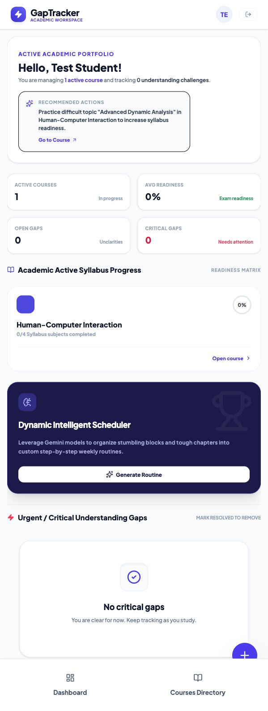
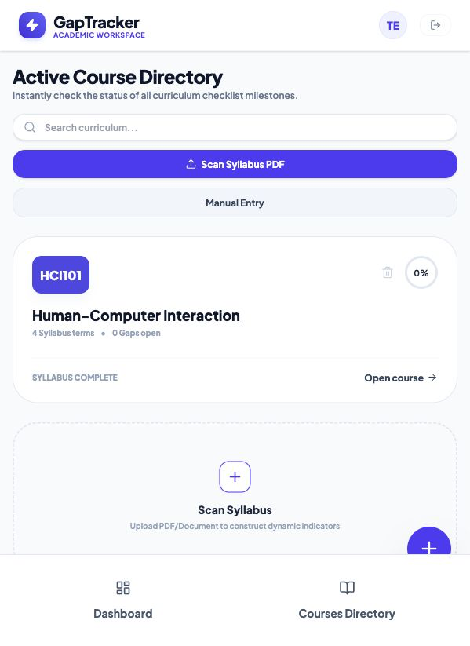
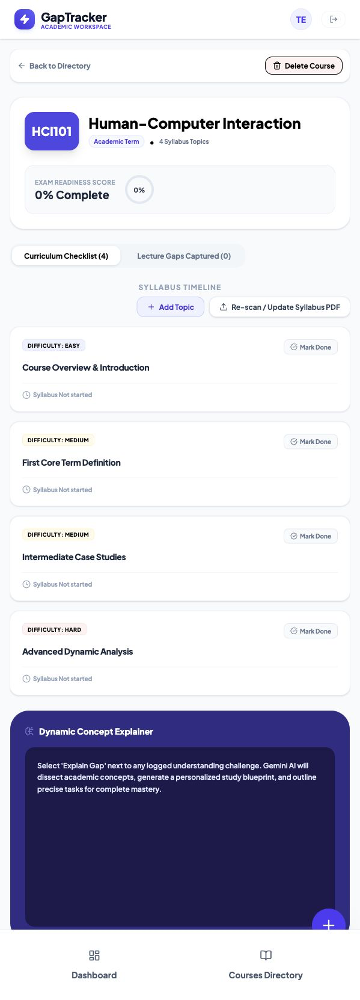

# GapTracker

GapTracker is a research-driven academic knowledge-gap management web app that helps students capture unclear topics, organize course material, and monitor exam readiness.

The project combines UI/UX research with a working public prototype. It focuses on a student problem that is easy to recognize: knowledge gaps are often noticed too late, poorly defined, and left untreated until exam pressure builds.

## Live Demo

**[Open GapTracker](https://gaptracker-academic-knowledge-gap-management-117567148344.europe-west2.run.app/)**

The deployed prototype runs on Google Cloud Run and is intended for portfolio and academic review.



## Product Preview

<table>
  <tr>
    <th>Dashboard</th>
    <th>Course Directory</th>
    <th>Course Detail</th>
  </tr>
  <tr>
    <td valign="top">
      
    </td>
    <td valign="top">
      
    </td>
    <td valign="top">
      
    </td>
  </tr>
</table>

## What GapTracker Does

- Creates a personal academic workspace after sign-in.
- Starts new users with an empty dashboard instead of predefined demo courses.
- Lets students add courses manually.
- Supports syllabus upload for AI-assisted course-topic extraction.
- Tracks syllabus progress and course readiness.
- Helps students record and prioritize understanding gaps.
- Highlights critical gaps that need attention before exams.

## Problem

Students often accumulate hidden academic knowledge gaps during lectures, practice, and assignments. By the time those gaps become obvious, the student may already be close to an exam and under pressure.

The research behind GapTracker identified three recurring issues:

- Students often notice gaps too late.
- Students struggle to define exactly what they did not understand.
- Students postpone treatment of gaps even after noticing them.

## Solution Model

GapTracker turns a vague moment of confusion into a trackable learning object:

```text
Moment of confusion
  -> quick capture
  -> course/topic context
  -> priority level
  -> treatment action
  -> readiness update
```

This gives students a clearer answer to three questions:

- What do I still not understand?
- What matters most before the exam?
- What have I already resolved?

## AI-Assisted Syllabus Processing

The syllabus feature is designed to accept an uploaded course document and use an AI model to:

1. Identify course structure.
2. Extract topics and learning units.
3. Convert the extracted content into a trackable checklist.
4. Connect completed topics with the readiness dashboard.

### AI And Free-Tier Constraints

The deployed prototype uses Gemini API features with free-tier constraints. AI actions may be temporarily unavailable if quota or rate limits are reached.

AI-generated syllabus topics should also be reviewed by the student. Extracted topics may require correction depending on the quality and structure of the uploaded document.

## Research Foundation

GapTracker was designed from student UX research, including:

- 36 survey respondents.
- Qualitative user interviews.
- Personas.
- Competitive analysis.
- UX principles such as visibility of system status, recognition over recall, reduced cognitive load, error prevention, and privacy.

Read the full [Research Summary](docs/research-summary.md).

Download the English research model deck:

- [GapTracker Research Models PPTX](docs/GapTracker-Research-Models.pptx)

## Research-To-Design Decisions

| Research finding | Product decision |
|---|---|
| Students struggle to define unclear topics | Support quick gap capture with short descriptions and optional evidence |
| Students postpone treatment | Show visible statuses and treatment actions |
| All gaps can feel equally urgent | Add criticality and priority indicators |
| Students notice gaps close to exams | Encourage in-the-moment capture during study |
| Students prefer lightweight tools | Keep setup and creation flows short |
| Students fear social judgment | Keep tracking private by default |

## Technology

Current deployed prototype:

- Google AI Studio
- Gemini API
- Google Cloud Run
- Generated web frontend

The exported application source code has not been added to this repository yet. Once it is added, this section should be updated with the exact framework, package manager, and local development commands.

## Repository Contents

```text
GapTracker/
  README.md
  .gitignore
  docs/
    hci-user-research-report.md
    research-summary.md
    GapTracker-Research-Models.pptx
    images/
      dashboard.png
      courses-directory.png
      course-detail.png
```

## Current Prototype Notes

- The app is a portfolio and academic prototype.
- Gemini-powered features may be rate-limited during public testing.
- AI-extracted syllabus topics should be reviewed before being treated as final.
- The readiness score is a product-support indicator, not a scientifically validated prediction of exam performance.
- Manual course and topic management is still being refined.

## My Contributions

- Continued the project independently after the initial research phase.
- Redesigned and expanded the original product concept.
- Developed the functional GapTracker web application.
- Implemented AI-assisted syllabus extraction and topic generation.
- Designed the current user interface and product workflows.
- Added course, gap, readiness, and syllabus-management functionality.
- Deployed the application to Google Cloud Run.

## Usage and Rights

This repository is publicly available for portfolio and academic-review purposes only.

The current application, later product development, deployment, and technical documentation were created by **Ehab Marrid**. The original academic research phase was completed collaboratively by **Ehab Marrid and Saleem Trudi** and is credited accordingly.

Copyright © 2026 Ehab Marrid. All rights reserved. No permission is granted to copy, modify, distribute, sublicense, or use the application commercially without prior written permission. Original jointly created research materials remain attributed to their respective contributors.
