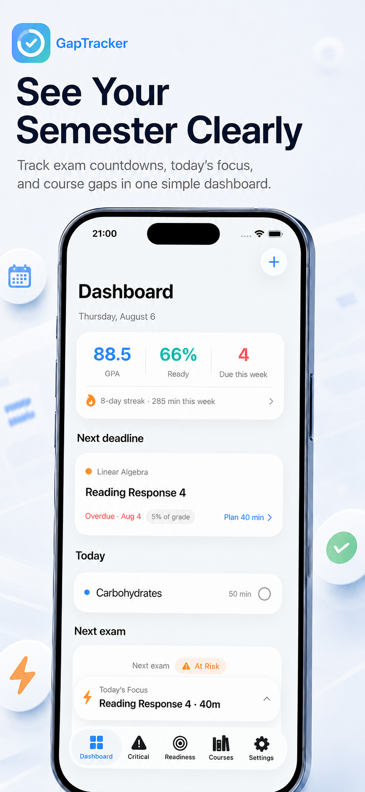
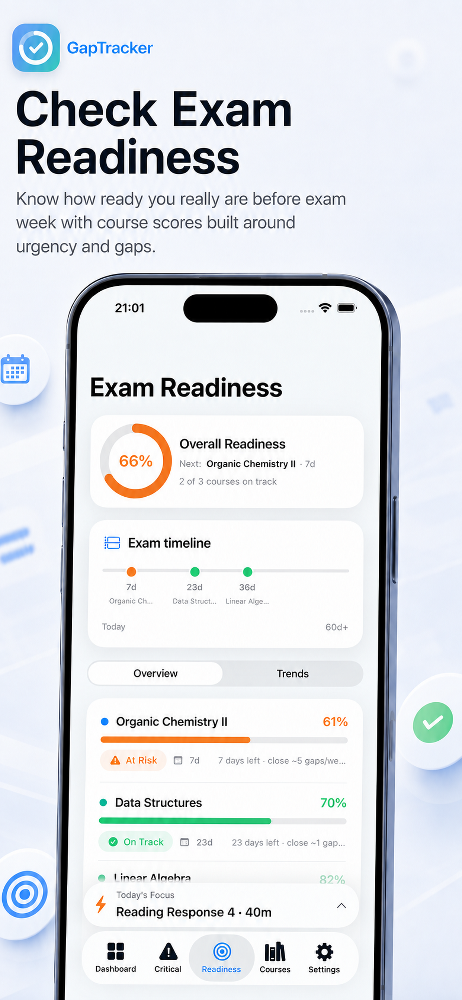
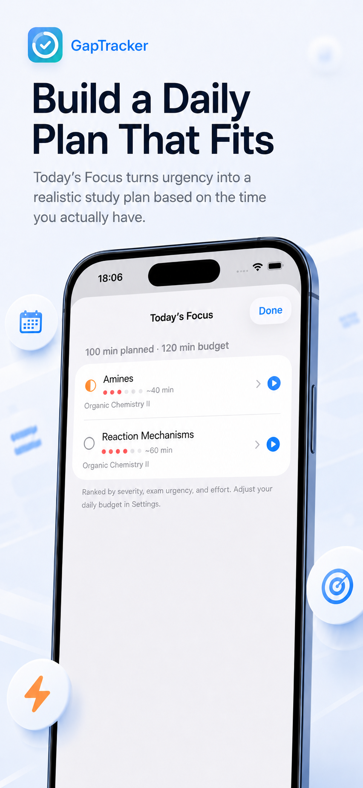
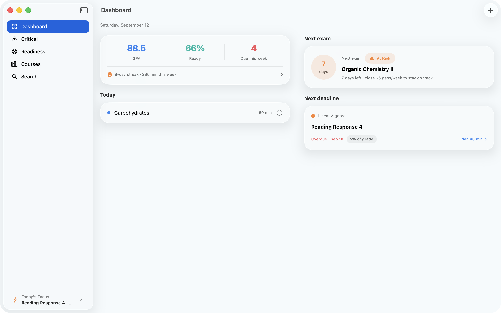
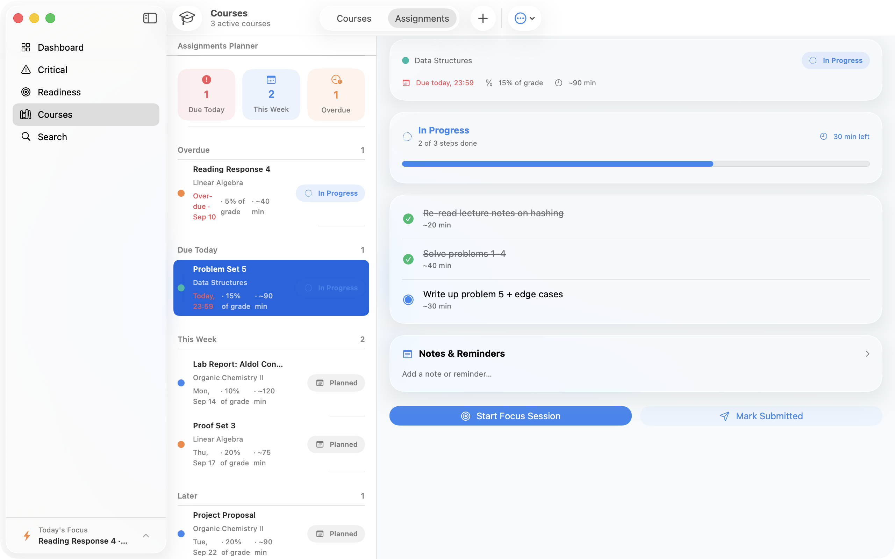
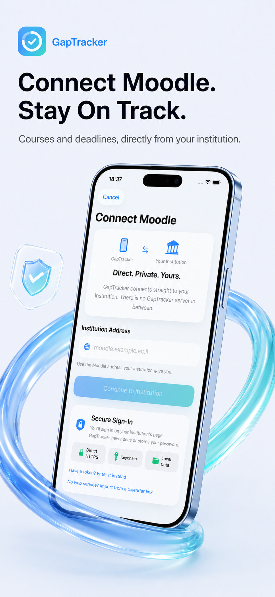

# GapTracker: Study Planner

<p align="center">
  <a href="https://apps.apple.com/app/id6782966586">
    
  </a>
</p>

<p align="center">
  <strong>Exams, assignments, and GPA. One clear plan.</strong><br>
  GapTracker brings courses, syllabi, assignments, learning-platform deadlines, grades, and knowledge gaps into one clear study plan.
</p>

<p align="center">
  iPhone, iPad, Mac & Apple Watch · Version 3.0 · Education · 9 languages
</p>

---

## Product Preview

<table>
  <tr>
    <th>Dashboard</th>
    <th>Exam Readiness</th>
    <th>Today's Focus</th>
  </tr>
  <tr>
    <td valign="top">
      
    </td>
    <td valign="top">
      
    </td>
    <td valign="top">
      
    </td>
  </tr>
</table>

### New on Mac in Version 3.0

<table>
  <tr>
    <td width="50%" align="center" valign="top">
      <a href="docs/images/mac-dashboard.png">
        
      </a>
      <br>
      <strong>Mac Dashboard</strong><br>
      <sub>Readiness, deadlines, Today's Focus, and study momentum at a glance.</sub>
    </td>
    <td width="50%" align="center" valign="top">
      <a href="docs/images/mac-assignment-planner.png">
        
      </a>
      <br>
      <strong>Assignment Planner</strong><br>
      <sub>Review deadlines, work through subtasks, and begin a focused study session.</sub>
    </td>
  </tr>
</table>

## What GapTracker Does

GapTracker is a study planner and exam-readiness app for students who want a clearer answer to one question:

> Am I actually ready for my next exam?

The app helps students:

- Add courses manually.
- Import a syllabus from a PDF or a photo.
- Use AI-assisted syllabus processing to extract course topics.
- Review extracted topics before adding them.
- Track topic difficulty, severity, and progress.
- See a readiness score for each course and overall readiness across courses.
- Prioritize critical gaps before exams.
- Build a realistic daily focus plan based on the study time available.
- Plan assignments with due dates, grade weights, time estimates, and subtasks.
- See assignments due today, this week, or overdue.
- Track current GPA, target grades, projected results, passed courses, and degree completion.
- Enter a final course grade to move the course to Passed and update the GPA.
- Run focus sessions, track study minutes, and build a study streak.
- Follow active study sessions on the Lock Screen, check progress from the Home Screen widget, and review study patterns in Insights.
- Use the native Mac app with desktop navigation, keyboard shortcuts, a Settings window, a menu-bar focus timer, and a desktop widget.
- Use the redesigned iPad interface with sidebar navigation and multi-column detail views.
- Check exam readiness, exam countdowns, Today's Focus, and study streak from Apple Watch.
- Start today's topic, pause or finish a focus session, and follow its live countdown from Apple Watch.
- Add GapTracker complications to an Apple Watch face for at-a-glance readiness and focus-session status.
- Start studying, log a study session, add an assignment, or open a course with Siri and Shortcuts.
- Find courses and assignments through Spotlight and open them directly in GapTracker.
- Choose course-specific widgets, complete today's topics from the large widget, and add Lock Screen widgets.
- Start a focus session from Control Center or the Action button, then pause or finish it from the Live Activity.
- Manage Moodle and Canvas from one Learning Platforms hub.
- Import Moodle courses, assignments, submission status, calendar deadlines, and exams.
- Import Canvas assignments and due dates directly from the Canvas calendar.
- Review Canvas items marked as New, Updated, or Matched before importing.
- Keep learning-platform data on the device without creating a GapTracker account.
- Keep progress available across devices with optional iCloud sync.

## App Store Version

**GapTracker: Study Planner**, version **3.0**, is available on the App Store:

**[Open GapTracker: Study Planner on the App Store](https://apps.apple.com/app/id6782966586)**

Version 3.0 brings GapTracker to Mac, adds Siri, Shortcuts, and Spotlight integrations, expands widgets and system controls, and gives Apple Watch more ways to manage focus sessions.

The Mac app includes a native sidebar, a dedicated Settings window, keyboard shortcuts, a menu-bar focus timer, and a desktop widget. One App Store purchase provides access across supported Apple devices.

Version 3.0 is designed to run smoothly on iOS 27, iPadOS 27, macOS 27, and watchOS 27 while continuing to support iOS 18 and later.

The app was previously published as **GapTracker: Exam Readiness**.

The older Google Cloud web demo is no longer active, so this repository now focuses on the shipped Apple-platform product, product screenshots, research background, and documentation.

## Problem

Students often discover academic knowledge gaps too late. A topic may feel unclear during a lecture, practice session, or assignment, but without a simple way to record and prioritize it, the gap is usually postponed until exam pressure builds.

The research behind GapTracker identified three recurring issues:

- Students often notice gaps too late.
- Students struggle to define exactly what they did not understand.
- Students postpone treatment of gaps even after noticing them.

## Solution Model

GapTracker turns a vague moment of confusion into a trackable learning object:

```text
Moment of confusion
  -> course or syllabus topic
  -> severity and urgency
  -> readiness impact
  -> daily focus plan
  -> progress update
```

This gives students a clearer answer to three questions:

- What do I still not understand?
- What matters most before the exam?
- What should I study today?

## AI-Assisted Syllabus Processing

GapTracker includes AI-assisted syllabus processing for students who do not want to build every course manually.

The syllabus workflow is designed to:

1. Accept a syllabus from a PDF or photo.
2. Extract course topics, learning units, difficulty signals, and grading structure.
3. Let the student review the extracted content before adding it.
4. Convert the approved topics into a trackable course checklist.
5. Connect completed topics and unresolved gaps to the readiness dashboard.

AI-generated topics should always be reviewed by the student. The extraction quality can depend on the syllabus layout, scan quality, and how clearly the course information is written.

## Readiness and Prioritization

GapTracker is built around three connected product views:

### Dashboard

The dashboard gives a quick overview of the semester, including current GPA, upcoming assignments and exams, the next deadline, current streak, weekly study time, today's focus, and open gaps by course.

### Exam Readiness

The readiness screen shows one score per course and an overall readiness score. The score is designed to consider factors such as course progress, topic severity, credit weight, and how close the exam is.

### Today's Focus

Today's Focus ranks what the student should study next based on urgency, severity, and the daily study-time budget. Instead of showing every possible task, it turns the semester into a realistic plan for the day.

## Mac, iPad, and Apple Watch

Version 3.0 brings GapTracker to Mac and expands its system-level study controls, building on the iPad and Apple Watch experiences introduced in version 2.3.

### Native Mac App

GapTracker is now a native Mac app with the same local-first approach used on iPhone and iPad. The desktop experience includes:

- Sidebar navigation for Dashboard, Critical Gaps, Readiness, Courses, and Search.
- A dedicated Settings window.
- Keyboard shortcuts for common actions.
- A menu-bar focus timer.
- A desktop widget for study progress.
- Optional iCloud synchronization across supported Apple devices.

### Redesigned for iPad

Version 2.3 introduced a dedicated sidebar for browsing courses, assignments, and settings. Details appear beside the selected item in a spacious multi-column layout that makes better use of the larger screen.

### GapTracker for Apple Watch

The Apple Watch app keeps essential study information and focus controls within easy reach:

- Exam readiness
- Upcoming exam countdowns
- Today's Focus
- Current study streak
- Starting today's priority topic
- Pausing or finishing an active focus session
- A live focus countdown on the watch face

Watch-face complications provide glanceable access to readiness and active-session information throughout the day.

## Siri, Shortcuts, and Spotlight

Version 3.0 makes core GapTracker actions available through Apple system integrations:

- Ask Siri to start studying and begin a focus session on the highest-priority topic.
- Log a study session, add an assignment, or open a course by voice.
- Add GapTracker actions to personal Shortcuts and automations.
- Find courses and assignments in Spotlight and open the matching screen directly.

## Widgets and System Controls

GapTracker's widgets and focus-session controls now extend across more system surfaces:

- Choose a specific course for a widget.
- Complete today's topics from the large widget.
- Add GapTracker widgets to the Lock Screen.
- Start a focus session from Control Center or the Action button.
- Pause or finish an active session from its Live Activity.

## Platform Compatibility

Version 3.0 prepares GapTracker for iOS 27, iPadOS 27, macOS 27, and watchOS 27 from day one. iOS 18 and later remain supported.

This release also establishes the foundation for deeper Siri and Spotlight integration, smarter widgets, and additional system features in future updates.

## Assignments, GPA, and Study Momentum

Version 2.0.1 expanded GapTracker beyond exam readiness into broader semester planning.

### Assignment Planning

Assignments can include a due date, grade weight, and estimated completion time, then be divided into smaller subtasks. Dedicated views make it easier to see what is due today, this week, or overdue, and assignments can be completed using the built-in focus timer.

### GPA and Degree Progress

Students can add passed courses, view their current GPA, track degree completion, and set a target grade for each active course to project where their GPA may land. Entering a final grade moves a completed course to Passed and updates the GPA.

### Study Momentum

Focus sessions can be started for a topic or assignment and are recorded in the study history. Active sessions can be followed from the Lock Screen, progress is available through the Home Screen widget, and Insights highlights study patterns and strongest study days.

## Learning Platform Integrations

Version 2.2 brings Moodle and Canvas together inside a single Learning Platforms hub.

Students can connect, review imported academic information, and manage learning-platform content without creating a GapTracker account or sending it through a GapTracker-operated server.

### Canvas

GapTracker can connect to a Canvas calendar and import assignments and due dates directly into the study planner.

Before importing, students can review the Canvas feed and see whether each item is:

- **New** — not yet available in GapTracker
- **Updated** — changed since it was previously imported
- **Matched** — already connected to an existing assignment

Approved items can be imported in one tap and matched with the appropriate course.

### Moodle

Version 2.1 introduced direct Moodle integration for courses, assignments, submission status, calendar events, and exams.

<p align="center">
  <a href="docs/images/moodle-connect.png">
    
  </a>
</p>

Moodle availability differs between institutions. GapTracker supports institutional SSO, personal Moodle tokens, and calendar-link import when full Moodle services are restricted or unavailable.

Calendar deadlines become GapTracker assignments, while exams appear as Dashboard events. Moodle-imported courses remain excluded from GPA calculations because institutional data may not contain a complete grade history.

### Local-First Privacy

Learning-platform integrations follow the same local-first approach as the rest of GapTracker:

- Moodle and Canvas communicate directly with the relevant institution.
- GapTracker does not operate an intermediary account server or academic-data database.
- Imported information remains on the device.
- Moodle authentication tokens are protected using the Apple Keychain.
- Optional iCloud synchronization remains controlled by the user.

### Synchronization

Students can refresh connected platforms from the Learning Platforms hub.

Moodle can also check for newly published assignments during supported iOS background-refresh opportunities and when the app returns to the foreground. Synchronization is throttled to reduce unnecessary network activity.

## Languages

GapTracker 2.2 adds seven new interface languages:

- Arabic
- German
- Spanish
- French
- Italian
- Portuguese (Brazil)
- Turkish

Together with English and Hebrew, GapTracker is now available in nine languages.

## Privacy-Oriented Product Direction

GapTracker is designed as a local-first personal academic tool. Courses, assignments, grades, topics, notes, imported learning-platform information, and study progress remain on the device.

No GapTracker account or developer-operated academic-data server is required. Optional iCloud synchronization is controlled by the user, and syllabus content is processed externally only when the user chooses an AI-assisted import action.

## Research Foundation

GapTracker was designed through a structured UI/UX research process focused on how university students identify, describe, prioritize, and resolve academic knowledge gaps.

The initial academic research phase was completed collaboratively by **Ehab Marrid and Saleem Trudi** and included:

- A student survey with 36 respondents.
- Three qualitative user interviews.
- User personas representing different learning contexts.
- Competitive analysis of existing productivity and study tools.
- Mapping research findings to product and interaction decisions.
- UX principles including visibility of system status, recognition over recall, cognitive-load reduction, error prevention, privacy, and psychological safety.

### Research Documents

- [Full HCI User Research Report](docs/hci-user-research-report.md)
- [Research Summary](docs/research-summary.md)
- [Research Models Presentation](docs/GapTracker-Research-Models.pptx)

## Research-To-Product Decisions

| Research finding | Product decision |
|---|---|
| Students notice gaps close to exams | Readiness score and exam countdowns make urgency visible |
| Students struggle to define unclear topics | Syllabus import and topic extraction give gaps clearer course context |
| Students postpone treatment | Today's Focus turns urgent gaps into a daily plan |
| All gaps can feel equally important | Severity and critical-gap ranking help prioritize |
| Students prefer lightweight tools | Courses can be added manually or generated from a syllabus |
| Students fear social judgment | Progress tracking is private and student-controlled |

## Technology

### Apple Platforms

- Native app experiences for iPhone, iPad, Mac, and Apple Watch.
- SwiftUI-based interface and app workflow.
- iOS/iPadOS 18+ support.
- Compatibility preparation for iOS 27, iPadOS 27, macOS 27, and watchOS 27.
- Native Mac navigation, Settings, keyboard shortcuts, menu-bar focus timer, and desktop widget.
- Redesigned iPad navigation with a sidebar and multi-column detail views.
- Apple Watch access to readiness, exam countdowns, Today's Focus, study streaks, focus controls, and watch-face complications.
- Siri, Shortcuts, and Spotlight integrations for study actions and direct navigation.
- Home Screen, Lock Screen, and desktop widgets, plus Live Activity, Control Center, and Action button controls.
- Localized in Arabic, English, French, German, Hebrew, Italian, Portuguese (Brazil), Spanish, and Turkish.
- On-device course, topic, assignment, grade, note, and progress management.
- Direct Moodle and Canvas integrations with a unified Learning Platforms hub.
- Local-first learning-platform imports without a GapTracker account or intermediary server.
- Optional iCloud sync for keeping courses available across devices.

### Product, Design, and Research

- Figma for interface design and product exploration.
- UI/UX research, surveys, interviews, personas, and competitive analysis.
- App Store product screenshots and release assets.

## Repository Scope

This repository is a public portfolio and product-documentation repository for GapTracker.

It includes:

- Product description.
- App Store link.
- Screenshots.
- Research documents.
- Design background.
- Product and feature documentation.

The application source code is not currently distributed through this repository.

## Repository Contents

```text
GapTracker/
  README.md
  .gitignore
  docs/
    hci-user-research-report.md
    research-summary.md
    GapTracker-Research-Models.pptx
    images/
      dashboard.png
      exam-readiness.png
      mac-assignment-planner.png
      mac-dashboard.png
      moodle-connect.png
      todays-focus.png
```

## Product Status and Limitations

- GapTracker is an active App Store product.
- The current App Store release is version 3.0.
- Version 2.0.1 expanded assignment planning, GPA tracking, and Exam Readiness.
- Version 2.1 introduced direct Moodle integration.
- Version 2.2 added Canvas integration, the Learning Platforms hub, seven additional languages, fixes, and interface polish.
- Version 2.3 introduced the redesigned iPad experience and GapTracker for Apple Watch.
- Version 3.0 adds the native Mac app, Siri, Shortcuts, Spotlight, expanded widgets and system controls, new Apple Watch focus actions, and compatibility preparation for the version 27 Apple operating systems.
- The previous Google Cloud web demo is no longer online.
- AI-extracted syllabus topics should be reviewed and corrected by the student before being treated as final.
- The readiness score is a planning and prioritization indicator. It is not a scientifically validated predictor of exam performance.
- Availability of external integrations may depend on network access and services operated by institutions or third-party providers.

## My Contributions

- Continued the project independently after the initial research phase.
- Redesigned and expanded the original product concept into a real iOS app.
- Designed the current user interface, app screenshots, and product workflows.
- Built the course, syllabus, gap, readiness, focus, and progress-tracking flows.
- Implemented AI-assisted syllabus extraction and topic generation.
- Added readiness scoring, critical-gap prioritization, and daily focus planning.
- Built assignment planning, GPA and degree-progress tracking, study Insights, and widget and Lock Screen integrations.
- Designed and built the Moodle import, course matching, deadline, exam-event, and synchronization experience.
- Designed and built the Canvas calendar import, feed review, assignment matching, and one-tap import experience.
- Created the unified Learning Platforms hub for Moodle and Canvas.
- Expanded GapTracker localization from two to nine languages.
- Redesigned the iPad experience with sidebar navigation and multi-column layouts.
- Designed and built the Apple Watch experience, including readiness, exam countdowns, Today's Focus, study streaks, and watch-face complications.
- Designed and built the native Mac experience, including sidebar navigation, Settings, keyboard shortcuts, a menu-bar focus timer, and a desktop widget.
- Added Siri, Shortcuts, and Spotlight integrations for study actions and direct navigation.
- Expanded widgets and focus-session controls across the Home Screen, Lock Screen, Live Activities, Control Center, the Action button, and Apple Watch.
- Prepared the app experience for iOS 27, iPadOS 27, macOS 27, and watchOS 27 while retaining iOS 18 support.
- Prepared the App Store release assets and public product documentation.
- Prepared the GitHub README, research documentation, and project attribution materials.

## Usage and Rights

This repository is publicly available for portfolio and academic-review purposes only.

The current GapTracker application, later product development, interface design, product documentation, screenshots, and technical documentation were created independently by **Ehab Marrid**.

The original academic research phase was completed collaboratively by **Ehab Marrid and Saleem Trudi** and remains credited to both contributors.

Copyright © 2026 Ehab Marrid for the independently created application and documentation. All rights reserved. No permission is granted to reproduce, modify, distribute, sublicense, or commercially use the independently created application materials or repository contents without prior written permission.

Rights and attribution for the jointly created research materials remain with their respective contributors.
